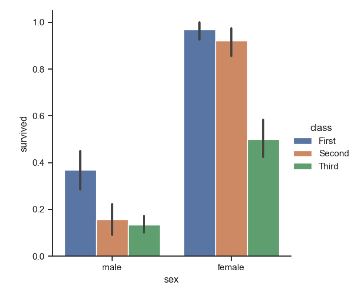

# 1. Headings

# 12- Content For making Content this method are used
we are going to be a heading

[1-Heading](#1-headings)\
[2-Block of Words](#2--block-of-words)\
[3-line Breaks](#3--line-breaks)\
[4-Combine Two thins](#4--combine-two-things)\
[5-Face of Text](#5--face-of-text)\
[6-Bullet Pointslists](#6--bullet-pointslitsts)\
[7-lines Breaks or page Breaks](#7--lines-breaks-or-page-breaks)\
[8-links and hyperlinks](#8--links-and-hyperlinks)\
[9-images and gigures with link](#9--images-and-figures-with-link)\
[10-Adding code or code block](#10--adding-code-or-code-block)\
[11-Adding tables](#11--adding-tables)\
[12-Content for makin content this method are used](#12--content-for-making-content-this-method-are-used)\
[13-Install Extensions](#13--install-extensions)


How to gives Heading in Mark down Files? 
 # Heading 1
 ## Heading 2
 ### Heading 3
 #### Heaidng 4

  # 2- Block of words

  >This is a normal text in Markown.

    This is a block of special text
    This is second line.

  # 3- Line Breaks

This is a 40 days long course Data Science with
Python AKA Python_Ka_Chilla_With_Mursaleen.\
This is a Second line.

# 4- Combine Two Things

Block of Words and heading

>## Heading 2

# 5- Face of Text

**Bold**

*Italic*

***Bold and Italic***

or you can use these symbols

-(underscore)

___Bold__

_Italic_

> write in comments about Bold and 

Italic with underscore

# 6- Bullet Points/Litsts

- Day-1
- Day-2
- Day-3
- Day-4
- Day-5
    - Day-5a
        - Subheading Anything
    - Day-5b
- Day-6
- Day-7

>__Using *or#__

* One

+ One


> Numbering Of Lists

1. Day1
2. Day2
3. Day3
4. Day4
5. Day5
    1. Day5a
    2. Day5b
6. Day6
7. Day7
8. Day8


# 7- Lines Breaks or Page Bresks

This is page1.
---
***
---
This page2.

# 8- Links and Hyperlinks

<https://www.youtube.com/watch?v=gD-IgqM58SI>

[The Playlist of Python ka chilla is 
Here](https://www.youtube.com/watch?v=gD-IgqM58SI)

[Codanics]:(https://www.youtube.com/watch?v=gD-IgqM58SI)

This Whole Course is [here][Codanics].

# 9- Images and Figures with Link

To join this course please scan the following QR code and join telegram
group:


> How to Comment out a markdown line?
and its shortcut? This Assighnment

Online Picture:


[Codanics]:(https://www.youtube.com/watch?v=gD-IgqM58SI))

in this image of half cut show in file lay out save karnay k liya ya hai

# 10- Adding code or code Block

To Print string use `print("Codanics)`

```
print("Hello Baba G")`

``````
```
x = 5+6
y = 3-2
z= x+y
print(z)
```

Diffrent programing Language may na code use krnay k liya name da ga to with languge change

```python
x = 5+6
y = 3-2
z= x+y
print(z)
```

>This code with show color according toR language syntax

```r
x = 5+6
y = 3-2
z= x+y
print(z)
```

# 11- Adding Tables

| species | petal_Length | Sepal_length
|---------|--------------|-------------|
|Virginica |18.2 | 19.2|
|setosa|18.2 | 19.2|
|Virsicolor |18.2 | 19.2|
|Virginica |18.2 | 19.2|
|setosa|18.2 | 19.2|
|Virsicolor |18.2 | 19.2|

For table Allighnment use this :-------:


# 13- Install extensions
**Mark down pdf**\
_Mark Down Lint\_\
Mark Down Short Cut_

Sample Of Text

Bold

Italic

Italic And Bold

Images

toggle to select image and click right


Column A | Column B | Column C
---------|----------|---------
 A1 | B1 | C1
 A2 | B2 | C2
 A3 | B3 | C3


Column A | Column B | Column C
---------|----------|---------
 A1 | B1 | C1
 A2 | B2 | C2
 A3 | B3 | C3 

